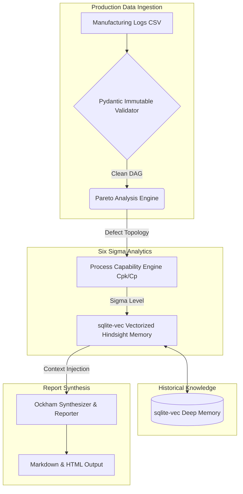

# 🧠 Sigma-Zero: Industrial Quality AI Orchestrator

An advanced, deterministic Multi-Agent Orchestration system engineered to autonomously execute the **Six Sigma DMAIC** (Define, Measure, Analyze, Improve, Control) methodology over manufacturing defect data, fusing industrial quality rigor with modern AI vector retrieval.

## 🏗️ System Architecture & Workflow

Sigma-Zero replaces manual process analysis and generic LLM guessing with a deterministic data validation pipeline and an embedded Graph-like Vector Memory (`sqlite-vec`), ensuring 100% data-anchored, zero-hallucination root cause synthesis.



## 🚀 Technical Highlights

* **Deterministic Ingestion & Validation:** Uses `Pydantic` models as the "Iron Truth" to validate production data types and constraints before processing, eliminating silent downstream failures.
* **Process Capability Engine (Cpk):** Automated statistical engine (using `pandas` and `numpy`) that mathematically calculates $Cp$, $Cpk$, and the $Sigma\ Level$ of the production line.
* **Embedded Vector Knowledge Base (sqlite-vec):** A fully local, serverless vector database embedded directly in SQLite. It queries historical defects and known solutions instantly without network overhead or heavy vector databases (Pinecone, Milvus).
* **Zero-Hallucination Synthesis:** Employs an adversarial data-grounding approach where the LLM (or deterministic templates) acts strictly as a formatter over mathematical truths and historically retrieved vectors.
* **Portable CLI Orchestration:** Managed via `uv` (ultrafast python package manager) to guarantee 100% reproducibility and hermetic environments across any Linux edge machine.

## 🛠️ Stack & Dependencies
- **Core Engine:** Python 3.12, `pydantic` (Deterministic schemas), `pandas`
- **Analytics & Vis:** `numpy`, `scipy`, `plotly`
- **Edge AI & Memory:** `sqlite-vec` (Embedded C++ WASM vector search)
- **Environment:** `uv`, `dotenv`

## ⚙️ Setup & Execution

### 1. Requirements
Ensure `uv` is installed on your system.
```bash
curl -LsSf https://astral.sh/uv/install.sh | sh
```

### 2. Execution
Run the zero-touch automated demo script. This will populate the simulated SQLite-vec knowledge base, calculate capabilities, and generate the final report.

```bash
cd sigma-zero
chmod +x demo.sh
./demo.sh
```

### 3. Testing
Execute the `pytest` suite to validate the statistical and validation engines:
```bash
uv run pytest tests/
```

---
*Built for rigorous Personal Knowledge Graph compilation and deterministic quality engineering.*
